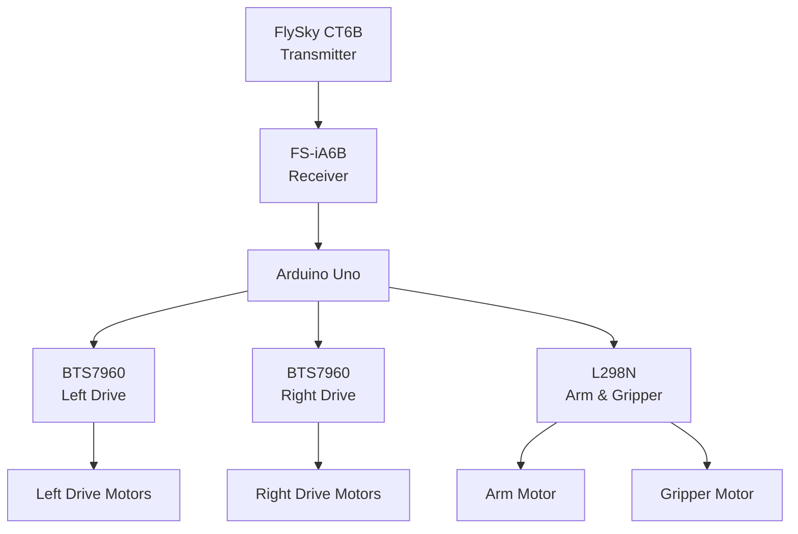

# FarmTrack V3 - Hardware Connections

This document describes the hardware connections used in FarmTrack V3.

The control system is built around an Arduino Uno, which receives six PWM channels from a FlySky receiver and controls the drivetrain, arm, and gripper through dedicated motor drivers.

---

# System Overview

---

# Receiver Connections

The FlySky receiver provides six PWM channels to the Arduino.

| Receiver Channel | Arduino Pin | Transmitter Control | Robot Function |
|------------------|-------------|---------------------|----------------|
| CH1 | A0 | VR-B | Reserved |
| CH2 | A1 | VR-A | Reserved |
| CH3 | A2 | Left Stick (Horizontal) | Gripper |
| CH4 | A3 | Left Stick (Vertical) | Throttle |
| CH5 | A4 | Right Stick (Vertical) | Arm |
| CH6 | A5 | Right Stick (Horizontal) | Steering |

The firmware continuously measures the PWM pulse width of all six channels using pin-change interrupts.

---

# Left Drive Motor Driver (BTS7960)

| BTS7960 Pin | Arduino Pin |
|-------------|-------------|
| RPWM | D6 |
| LPWM | D5 |

This driver powers the left-side drive motors.

---

# Right Drive Motor Driver (BTS7960)

| BTS7960 Pin | Arduino Pin |
|-------------|-------------|
| RPWM | D10 |
| LPWM | D11 |

This driver powers the right-side drive motors.

---

# Arm Motor Driver (L298N)

| L298N Pin | Arduino Pin |
|------------|-------------|
| ENA | D9 |
| IN1 | D8 |
| IN2 | D7 |

The arm motor is controlled independently from the drivetrain.

---

# Gripper Motor Driver (L298N)

| L298N Pin | Arduino Pin |
|------------|-------------|
| ENB | D3 |
| IN3 | D4 |
| IN4 | D2 |

The gripper motor uses the second H-bridge available on the L298N module.

---

# User Interface

| Component | Arduino Pin |
|-----------|-------------|
| Calibration Push Button | D12 |
| Status LED | D13 |

The push button is used to enter receiver calibration mode.

The built-in LED indicates the controller state and flashes during calibration.

---

# Power

The robot is powered from a **3S LiPo battery**.

The Arduino, motor drivers, receiver, and motors share a common ground.

Motor power is supplied directly from the battery through the motor drivers.

---

# Drive Configuration

The drivetrain uses:

- Four-wheel differential drive
- Two BTS7960 motor drivers
- Paired 12 V DC geared motors on each side
- Independent left and right speed control

Steering is achieved by varying the speed of the left and right drive motors.

---

# Arm and Gripper

The arm and gripper are controlled independently through the L298N motor driver.

The arm uses a worm-and-wheel mechanism to provide self-locking behavior, while the gripper is driven through a flexible shaft connected to a remotely mounted motor.

---

# Calibration

Receiver calibration is performed directly from the robot using the push button.

During calibration the firmware records:

- Minimum PWM value
- Maximum PWM value

These values are stored in EEPROM and automatically loaded during startup.

No changes to the source code are required after calibration.

---

# Notes

- All receiver inputs use standard PWM signals.
- The firmware monitors every receiver channel continuously.
- A failsafe stops every motor if receiver communication is lost.
- Receiver calibration data is stored in EEPROM.
- CH1 and CH2 are currently reserved for future expansion.

---

If you notice an error or have a suggestion for improving this project, feel free to open an issue or contact me through GitHub.