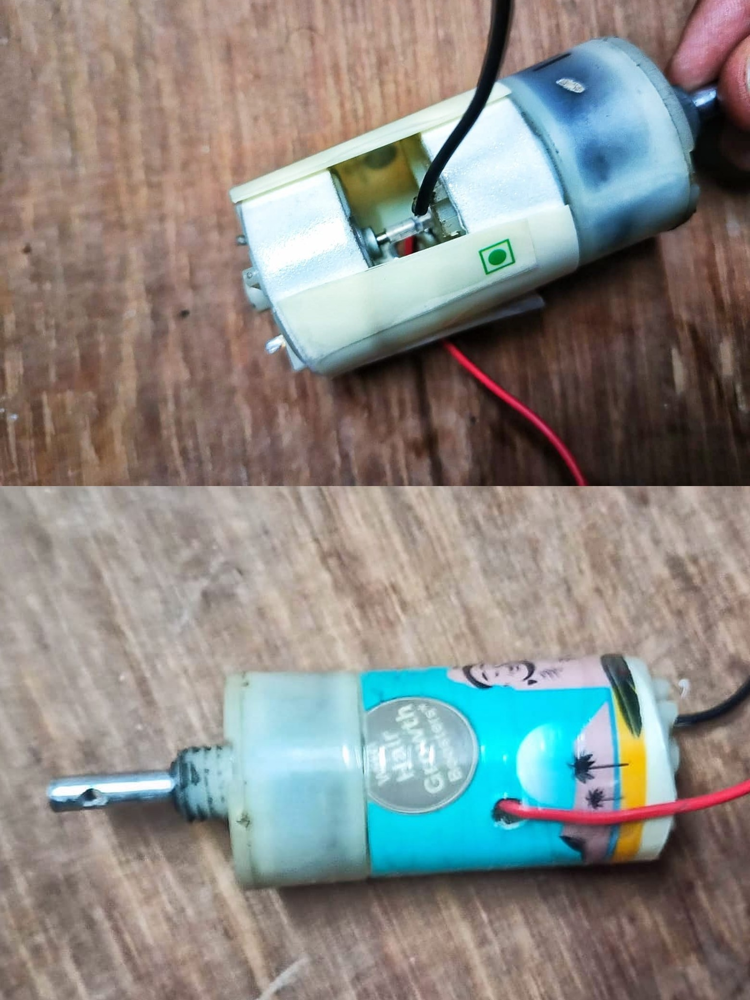

# FarmTrack V3

FarmTrack V3 is the third and final iteration of the Farm-Track project.

This version focused on integrating everything learned from the previous two iterations into a single platform. The primary objectives were higher speed, wireless control, better system integration, cleaner design, and an improved driving experience.

This directory contains the Arduino source code, hardware connections, and documentation for the V3 control system.

> **Note**
>
> The complete evolution of the project, including V1 and V2, can be found in the main **Farm-Track** repository.

---

## Features

- Four-wheel differential drive
- Wireless control using FlySky CT6B transmitter and FS-iA6B receiver
- Arduino-based control system
- Differential drive channel mixing
- Independent control of drivetrain, arm, and gripper
- Receiver calibration stored in EEPROM
- Automatic failsafe on signal loss
- Deadband compensation for smoother control
- Quadratic throttle response with non-linear steering
- On-board calibration using a push button
- Serial debugging for receiver monitoring

---

## Hardware

| Component | Description |
|-----------|-------------|
| Controller | Arduino Uno |
| Radio System | FlySky CT6B + FS-iA6B Receiver |
| Drive Motor Drivers | 2 × BTS7960 |
| Arm & Gripper Driver | L298N Dual H-Bridge |
| Drive Motors | 8 × 12V DC geared motors (paired configuration) |
| Arm Motor | 12V DC geared motor |
| Gripper Motor | 12V DC geared motor |
| Battery | 3S LiPo |
| User Interface | Push button and status LED |

---

## Project Images

### Complete Bot


---

### Electronics Layout


---

### Drive Motor Coupling



---

## Software Overview

The controller continuously reads six PWM channels from the FlySky receiver using pin change interrupts.

Each receiver channel is calibrated independently and stored in EEPROM, allowing the controller to compensate for transmitter variations without modifying the source code.

Joystick inputs are processed through dead zones and response curves before generating differential drive commands for the left and right sides of the bot.

The drivetrain, arm, and gripper are controlled independently, allowing smooth operation of all mechanisms.

If receiver communication is lost for more than 500 ms, the failsafe immediately stops every motor.

---

## Repository Structure

```
Farm-Track
│
├── README.md
├── LICENSE
├── CONNECTIONS.md
│
├── V1
│   ├── Images
│   └── Documentation
│
├── V2
│   ├── Images
│   └── Documentation
│
└── V3
    ├── FarmTrack_V3.ino
    ├── README.md
    ├── Images
    └── Documentation
```

---

## Future Improvements

Some improvements I would like to explore in future versions include:

- Closed-loop speed control using wheel encoders
- Current sensing for drivetrain protection
- IMU-assisted driving
- Custom PCB for motor control and wiring
- Modular wiring harness
- Brushless drivetrain

---

## License

This project is released under the MIT License.

---

## Author

**Bhavishya Chaudhary**

If you have any questions or suggestions, feel free to connect with me on LinkedIn or GitHub.
